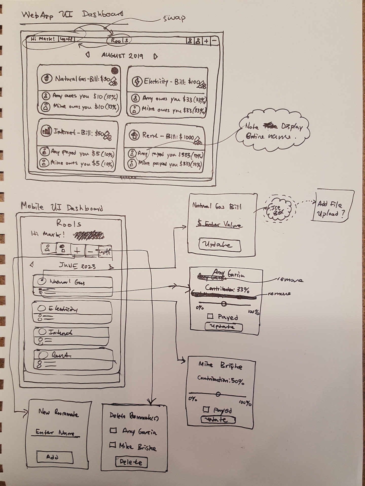

# ROOLS

<https://rools-app.herokuapp.com/> \
Version 1.0 \
Deployment Date: April 6, 2018  \
Contributors: Efosa Ogiesoba

# Purpose

ROOLS is short for roommate-bills. This is a bill management app for roommates built with ReactJS; App will keep track of 4 main bills that are most commonly shared among roommates: Electricity, Gas, Internet, & Rent. A maximum of 3 roommates can be added for each user. Once roommates, and total bill costs are added, contribution for each roommate can be included. A total percentage contribution for each roommate towards the total bill is also automatically calculated and displayed. 

# Screenshot - 1 - SignIn Page

# Screenshot - 2 - SignUp Page

# Screenshot - 3 - Main App Page

# UI Concept Design

# DB Schema Design

# IceBox

Ideas for future development.

1) Add file upload button for each bill.
2) Connect multiple roommate accounts into a group account where all roommates can see the same dashboard.
